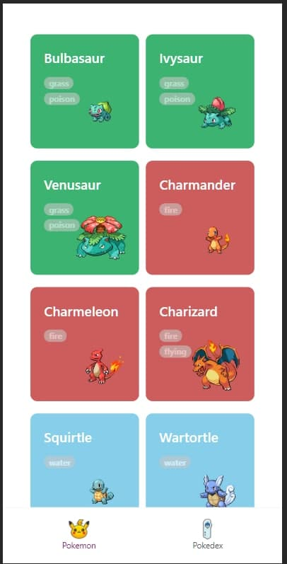
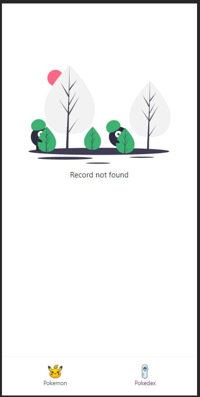
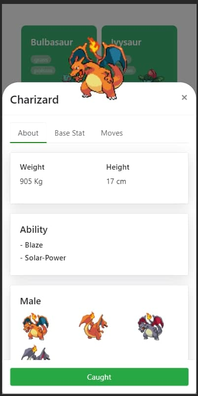
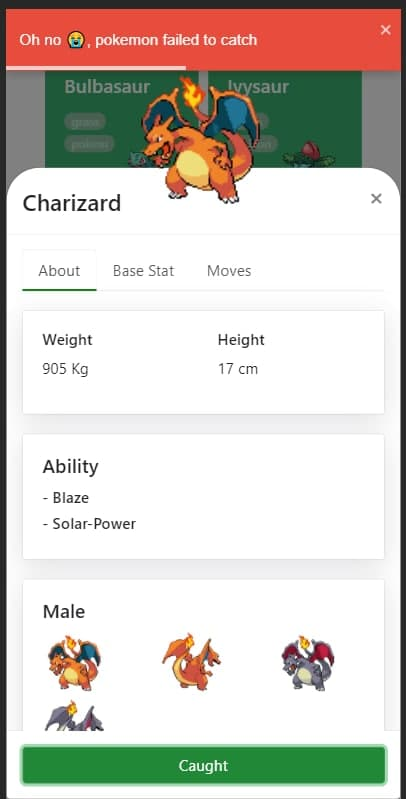
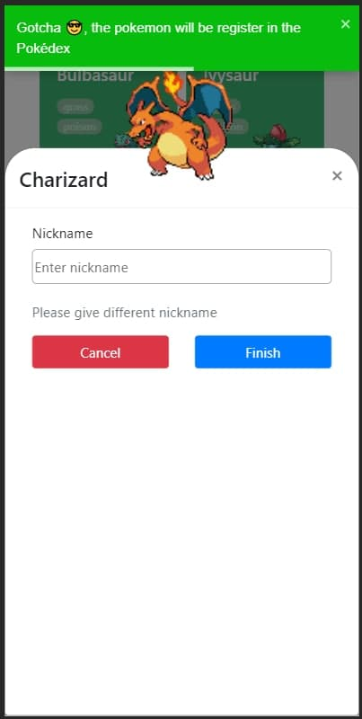
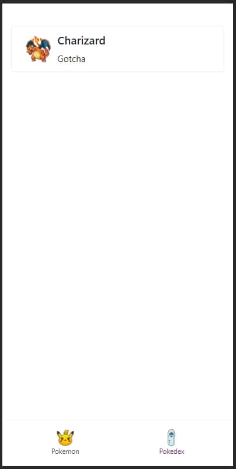

# Pokemon App

### Mobile App Preview

    

        
        
Pokemons Page

    

    

        
        
Pokedx No Record

    

    

        
        
Pokemon Detail

    

    

        
        
Pokemon Failed to Catch

    

    

        
        
Pokemon Caught

    

    

        
        
Pokedex Page

    

